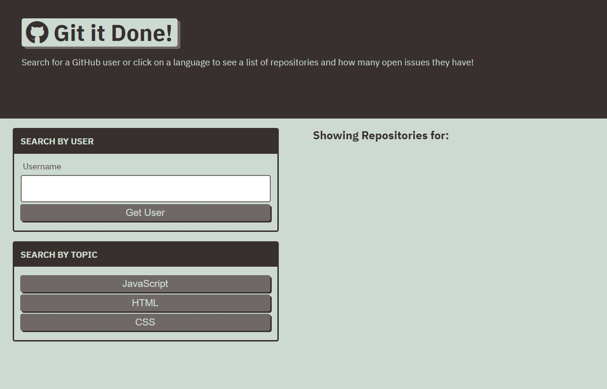

# GIT-IT-DONE

## 1. Description
This application was designed to make it easier for the user to browse repositories with open issues on github. The user can search any user on Github and wil get a list of all their repositories

DEPLOYMENT:
 [DIRECT LINK](https://cbushehry.github.io/git-it-done/) | [GITHUB REPOSITORY](https://github.com/cbushehry/git-it-done)

## 2. Features
 * Search any user on Github, for a list of all repositories
 * Click on any repository to see a list of all current unfinished 'Issues'
 * Direct links to the Github user from the currently unfinished 'Issues'
 * 'Search by Topic' button allows user to filter through large lists of repositories

 

## 3. Tech Stack
 * HTML
 * CSS
 * JavaScript
 * JQuery

## 4. Credits / Contact
This application was made by Cameron Bushehry

  
  

