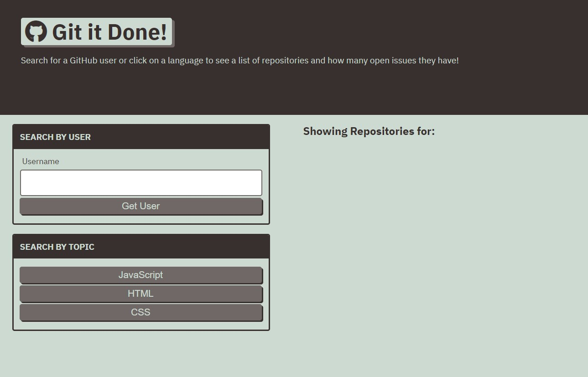

# GIT IT DONE

A GitHub repository browser that lets you search for open issues by username or programming language. Search any GitHub user to see all their repositories with open issue counts, or click a language button to discover featured repos sorted by help-wanted issues.

## Deployment
 [DIRECT LINK](https://cbushehry.github.io/git-it-done/) | [GITHUB REPOSITORY](https://github.com/cbushehry/git-it-done)

## Features
 * Search any GitHub username to see all of their public repositories with open issue counts
 * Search by language topic (JavaScript, HTML, or CSS) to see featured repositories sorted by help-wanted issues
 * Click any repository to view its full list of open issues and pull requests
 * Issues are labeled as either `(Issue)` or `(Pull request)` for easy distinction
 * Direct links from each issue to its corresponding GitHub page
 * Pagination warning displayed when a repository has more than 30 issues

## Tech Stack
 * HTML
 * CSS
 * JavaScript
 * GitHub REST API
 * Font Awesome

## Credits / Contact
This application was made by Cameron Bushehry

  
  